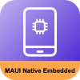

#  MAUI.Native.Embedded

[](https://www.nuget.org/packages/MarLoe.MAUI.Native.Embedded/)

Embed native iOS AppClips and iOS Widgets build with Xcode into you MAUI app.

MAUI currently does not support AppClips or Widgets for iOS. This NuGet will allow you to embed natively build AppClips & Widgets into you MAUI app.

Your native added projects will be build for you. You do not need to do anything but adding it.

[For full comprehensive documentation please read here.](MAUI.Native.Embedded.nuget/README.md)

## TLDR;
Support AppClip or Widget for iOS in your MAUI project by adding this to your project (.csproj) file:
```
<ItemGroup>
  <AppClips Include="./Platforms/iOS/Native/Native.xcodeproj" />
  <Widgets Include="./Platforms/iOS/Native/Native.xcodeproj" />
</ItemGroup>
```

## Disclaimer
Embedding native elements into MAUI might look easy with this NuGet.
But please note that this NuGet only puts the native part in the MAUI app.
Making C# talk to Swift/SwiftUI/Objective-C is not that easy. Also the provisioning profiles used in Xcode must match the ones you are using in the MAUI app.